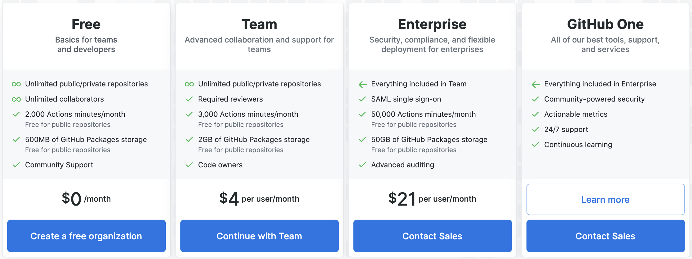
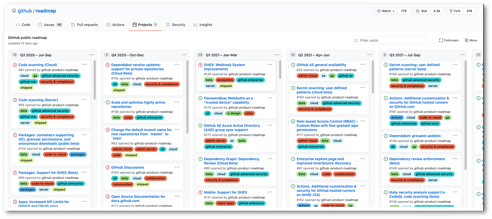

## GitHub Offerings

Let’s review the GitHub offerings from a product perspective.

This is important because one of the hardest things for new GitHub partners to understand is which parts of GitHub are offered in which product SKU. 

So, it is important for you to have this knowledge as you interact with customers.  For example, when discussing Advanced Security, you’ll want to understand which product the customer has and which ones they will need. 

## GitHub Cloud

You should be aware of the offering GitHub Cloud. First and foremost, GitHub Cloud is what most of you are familiar with from using GitHub.com. This is the easiest environment for a customer to use, create an org, sign up users, etc. 

**It is great for new teams just getting started with GitHub.** 
Teams on this plan graduate to the GitHub Enterprise Cloud plan when their needs grow

**Very few customers use this option**
Fast and straightforward deployment, up in minutes
Lightweight pricing to make it approachable for new companies

**Note:** GitHub Cloud will not offer the level of security that a larger enterprise will require. Small teams, non-profits, or startups may begin with this level. 

## GitHub Enterprise Cloud

Effortless infrastructure, the power of the community, and all the integrations you know and love

**Features overview:** 

- Fast and straightforward deployment, up in minutes
- Setup is usually focused on SSO integration and permission config
- Enterprise accounts can enable easier management of multiple business organizations

Participants who are interested in a more advanced level of security, do not require on-prem installations, and have multiple organizations will be attracted to Enterprise Cloud

That’s the simple side, there are other things like SAML and AAD (Azure Active Directory) so you can use the same authentication.

With Cloud, GitHub hosts it for you, everything is managed for you, so what you’re really administering is your policies, your users, and how you use the product. You don’t have to manage the deployment. 

********
**Resources:**

https://help.github.com/en/github/setting-up-and-managing-your-enterprise-account/about-enterprise-accounts
********

## GitHub Enterprise Server

GitHub Enterprise Server enables customers to manage their infrastructure and isolate their data.

This offering moves away from the cloud and offers an on-prem version of GitHub Enterprise.  This product version also gives the customer direct control over system optimization. 

It’s an appliance that you run on your own hardware or within cloud provider hardware. It is more involved, you have to maintain, manage, set it up, but once it’s set up and running, the user experience is going to be almost identical, with the main exceptions being the URL from which users would access it and “public” repositories on Server means something different than “public” on Cloud. We’ll get into that in more detail tomorrow. 

**Feature overview:**

- More involved setup, but an easy deployment and can be running in minutes
- Same code base as GitHub Enterprise Cloud, but features usually land a few months after GHEC
- More optimization of the environment to fit the needs of your organization

**Important note:** Feature updates are often on a delivery schedule behind GHEC.

**GHES** - for those of you who know ADO, there’s server vs cloud, and it’s the same on the GH side.

**GitHub Connect:** gives you the option to connect GitHub Enterprise Cloud and GitHub Enterprise Server so contributions and unified search are available on GitHub Enterprise Server

## GitHub One

GitHub One is different than other SKUs because it includes a-la-carte products by definition.

**Feature overview**

With GH One, in addition to GHE, you get access to the features and products listed here. 

- Advanced Security
- GitHub Insights
- 24/7 Premium Plus support
- Learning Lab for organizations

GitHub One is a SKU that has been in development and is planned for broader adoption, but we aren’t necessarily there yet.  

**Notes:**

1. If this product is out of the scope of your potential customers, you may choose to skip or go very quickly over this section until GitHub One is more prominent.
2. Please consult your account manager to obtain details on any associated costs.

When you now get GHE, you buy a license, you get a license to both GHEC and GHES. It really comes down to a customer use case whether they choose server, cloud, or both. One is on top of that where you get access to more security, insights, support, and training. 

## GitHub AE

GitHub AE is a private, GitHub managed offering for companies that need high levels of security, privacy, and control in a SaaS-like environment. It is the most secure and compliant DevOps SaaS offering.

**Feature overview:**

- Data sovereignty
- Isolated infrastructure
- Enables provisioning of thousands of users at once
- More control of accounts for audits and access for enterprises
- Meets government cloud requirements. 
- Provides levels of security compliance to meet the needs of a specific subset of industries and government

**Questions the trainer should anticipate:** 

-  What is the upgrade cycle for GitHub AE?

**Additional context on GitHub AE:**

Use of "GitHub AE" in print and speech:

**In print:**
The full product name is GitHub AE. Abbreviations (after first use of full name in print):  GHAE 

**In speech:**
- GitHub AE is the preferred full spoken name.
- We will refer to AE (hard vowel pronunciations of A - E) as the preferred abbreviated spoken version of the name.

**Do not:**
- Refer to the product using ‘Aegis’ except in response to the questions about the meaning of the name.
- Abbreviate to GHE AE or GHEAE

## How do I get started?

Consult with your partner organization for the specifics. Include information about how your organization accesses these products.

Generally speaking, to get started with with GitHub’s Enterprise Cloud offerings: 

- Get a license through our Partner program 
- Download GitHub Enterprise (verify the best download location)
- Create an organization on GitHub

Partners can get access to licenses to play around with these features and products.

********
Resources
https://partner.github.com
https://enterprise.github.com/releases
********

## Sales View

The chart below comes from https://github.com/pricing. Check that this information is up to date, and relevant to your audience. 

## GitHub Public Roadmap

The GitHub public roadmap shows you exactly what we will be building next, which offerings it will apply to, and when it will be available.

********************
Roadmap source: 
https://github.com/github/roadmap/projects/1
********************
