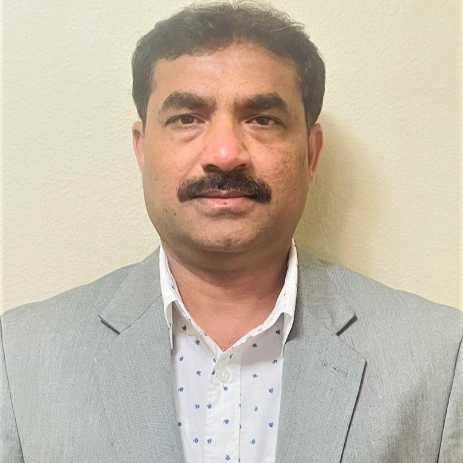

# Chaithanya Kumar Chandupatla (Chandu)

* TC: Analytics
* Level: Mgr
* Region: USA West

## Skills

* Data Architect
* BI - Power BI, OBIEE11g 
* ETL - MS SSIS, DataStage, Informatica, SAP BODS & ADF
* Cloud - Azure (Azure Data Factory, Azure SQL server, Azure Synapse, Azure Data Bricks, Data Lake, Azure log analytics, Cosmos etc. )
* Data Quality - SAP Information Steward technologies
* Agile - JIRA, TFS/AzureDevOps

## Certifications

* AZ-900
* DA-100
* Databrics Capstone

## DevOps Experience

* TFS
* VSTS/GitHub
* CICD (AzureDevOps) - Bench Training

## Biography

Chaithanya (Chandu) is a Manager, Data Engineer at Avanade, with experience in several industries, focused on the design and implementation of enterprise scale business solutions. 
He has hands-on experience designing, developing and implementation in Business Intelligence, Data warehouse and Big data landscape. 
He has performed as a  Technical Manager, Data Architect and Solution Developer roles and opted Agile and Waterfall methodologies. 
Chandu has proven experience leadership roles with on-shore and off-shore development teams.
